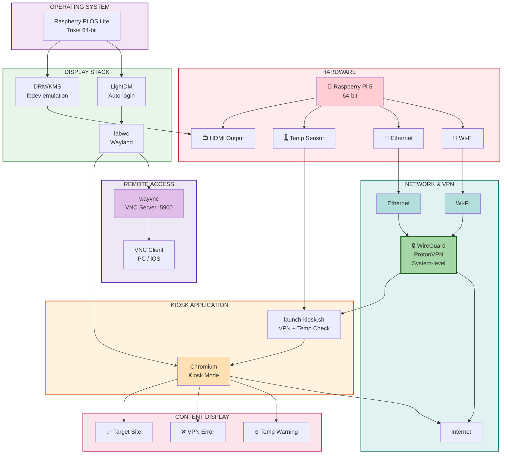

# pikiosk

Raspberry Pi 5 kiosk setup with VPN and remote VNC control.

## What it does

- Displays a target website in full-screen kiosk mode on HDMI
- Routes all traffic through **ProtonVPN WireGuard**
- Shows an error page if the VPN is down or temperature exceeds 80°C
- When there's **no network**, opens a `pikiosk-setup` WiFi hotspot so you can pick
  a network from your phone (or the on-screen list) — no VNC/internet needed
- Recovers automatically when conditions are restored
- Remote control via **VNC** (TigerVNC on PC, VNC Viewer on iOS)
- Navigable with a **TV/IR remote** (arrows + OK + Back) via a GPIO IR receiver
- SSH always available for management

## Stack

| Component | Role |
|---|---|
| Raspberry Pi OS Lite 64-bit (Trixie) | OS |
| LightDM | Display manager / autologin |
| labwc | Wayland compositor |
| wayvnc | VNC server (Wayland native) |
| Chromium | Kiosk browser |
| WireGuard / ProtonVPN | VPN |

## Architecture



## Folder structure

```
pikiosk/
├── README.md
├── .gitignore
├── install.sh              # Automated setup script
├── kiosk/
│   ├── launch-kiosk.sh     # VPN + temp check, launches Chromium
│   ├── ir-remote.sh        # Loads the IR keymap onto the gpio-ir receiver
│   ├── focus-ring/         # Tiny Chromium extension: thick focus outline + Back key
│   ├── vpn-error.html      # Shown when VPN is down
│   └── temp-warning.html   # Shown when temperature >= 80°C
├── config/
│   ├── labwc-autostart     # ~/.config/labwc/autostart (points at the clone)
│   ├── lightdm-autologin.conf  # /etc/lightdm/lightdm.conf.d/
│   ├── drm.conf            # /etc/modprobe.d/drm.conf
│   ├── ir-keymap.toml      # TV-remote scancodes → key events (NEC)
│   ├── pikiosk-ir.service  # systemd unit that loads the IR keymap at boot
│   └── wireguard-template.conf  # Template for /etc/wireguard/protonvpn.conf
├── scripts/
│   ├── monitor.sh          # Live power and temperature monitor
│   ├── clean-browser.sh    # Clear Chromium cache/cookies and restart the kiosk
│   └── kiosk.sh            # Start/stop/restart the kiosk app without rebooting
└── wifi-portal/            # Offline WiFi setup (hotspot + captive page)
    ├── server.py           # HTTP backend driving nmcli
    ├── wifi-setup.html     # QR auto-join + interactive network list
    ├── hotspot.sh          # up/down/status of the pikiosk-setup hotspot
    ├── net-prefer.sh       # standalone ethernet-preference logic
    ├── portal.conf         # hotspot SSID/pass, port, timeout
    ├── run-local.sh        # run the portal locally with the mock
    └── mock/nmcli          # fake nmcli for local testing
```

**Run-in-place:** scripts run directly from the clone — nothing is copied into the
home dir. `install.sh` only installs the `/etc` files (LightDM, DRM, WireGuard) and
points the labwc autostart at this clone's `kiosk/launch-kiosk.sh`. To update later:
```bash
cd pikiosk && git pull    # then reboot, or restart labwc
```

## Quick setup

1. Flash **Raspberry Pi OS Lite 64-bit** to microSD via Raspberry Pi Imager (enable SSH, set Wi-Fi).
2. SSH into the Pi and clone this repo:
   ```bash
   sudo apt install -y git
   git clone https://github.com/YOUR_USERNAME/pikiosk.git
   cd pikiosk
   ```
3. Copy your ProtonVPN WireGuard config:
   ```bash
   cp /path/to/protonvpn-uk.conf config/wireguard.conf
   ```
4. Run the installer:
   ```bash
   chmod +x install.sh
   ./install.sh
   ```
5. Reboot:
   ```bash
   sudo reboot
   ```

## Changing the target site

Edit `kiosk/launch-kiosk.sh` and update the `URL_SITE` variable at the top.

## HDMI audio

The kiosk forces the **HDMI audio sink to 100%** and unmutes it. This is handled by
`set_hdmi_volume()` in `launch-kiosk.sh`, called at startup and every 30s in the monitor
loop, so the volume stays at 100% after every reboot and after HDMI reconnects / profile
changes. The sink is found **by name** (its `node.name` must contain `hdmi`) because
PipeWire node IDs change on every boot — do not hardcode `wpctl set-volume <ID>`.

```bash
# Check current audio sinks and volumes
wpctl status

# Confirm HDMI was set (look for the "HDMI sink ... set to 100%" line)
grep HDMI /tmp/kiosk.log
```

## IR remote control

The kiosk can be driven with a **TV remote** (or any IR remote) via a cheap IR
receiver module wired to the GPIO header — navigate the site like a smart TV.

> **Opt-in — off by default.** `install.sh` does **not** set up the IR receiver
> unless you enable it: `ENABLE_IR=1 ./install.sh`. Without that flag no overlay is
> added and the `pikiosk-ir` service is not installed. To disable it on a Pi where
> it was already set up, see **[Disabling the IR remote](#disabling-the-ir-remote)**.

**Wiring** (3 wires, Pi powered off):

| IR module pin | Raspberry pin | Note |
|---|---|---|
| VCC | Pin 1 (3.3V) | **3.3V, not 5V** — keeps the DAT output at a GPIO-safe level |
| GND | Pin 6 (GND) | any ground pin works |
| DAT / OUT | Pin 12 (GPIO18) | the signal line the kernel reads |

**How it works:** the `gpio-ir` device-tree overlay makes the kernel decode the IR
signal; `ir-remote.sh` (run at boot by the `pikiosk-ir` systemd service) loads
`config/ir-keymap.toml` onto the receiver with `ir-keytable`. From then on the
kernel emits standard key events for each button — no daemon runs. labwc forwards
them to Chromium, which is launched with `--enable-spatial-navigation` so the arrow
keys move focus between links/buttons by on-screen position:

| Remote button | Key event | Action in Chromium |
|---|---|---|
| Up / Down / Left / Right | `KEY_UP/DOWN/LEFT/RIGHT` | move focus spatially |
| OK | `KEY_ENTER` | activate the focused element |
| Back | `KEY_BACK` | go back in history |

Chromium's default focus outline is a thin line that's hard to see from the sofa, so
`launch-kiosk.sh` also loads `kiosk/focus-ring/` (`--load-extension`): a local
extension whose CSS draws a thick yellow outline with a dark halo around the focused
element on every page. Tweak thickness/colour in `kiosk/focus-ring/focus.css`, then
`./scripts/kiosk.sh restart`. The same extension handles **Back**: on Linux/Wayland
Chromium ignores `KEY_BACK` (`BrowserBack`), so `back.js` catches it and calls
`history.back()` to return to the previous page.

The default keymap uses the NEC scancodes of one specific remote. **Your remote is
different** — re-capture its codes and edit `config/ir-keymap.toml`:

```bash
# Find the gpio-ir device and listen (press each button, note the scancode):
ir-keytable                       # shows the rcN backed by gpio_ir_recv
sudo ir-keytable -s rc2 -c -p all -t   # replace rc2 with your device

# Edit config/ir-keymap.toml with the scancodes, then re-apply:
sudo systemctl restart pikiosk-ir
tail -n 20 /tmp/kiosk-ir.log      # confirms which device/keymap was loaded
```

Troubleshooting: nothing decoded → check the remote is really IR (its LED blinks
when seen through a phone camera) and that `pinctrl get 18` reads `hi` at rest
(a `lo` means the module isn't powered / DAT isn't wired — a VCC↔DAT swap is the
usual cause). `dtoverlay=gpio-ir,gpio_pin=18` must be in `/boot/firmware/config.txt`
(added by `ENABLE_IR=1 ./install.sh`) and takes effect only after a reboot.

### Disabling the IR remote

`install.sh` no longer sets up IR by default, but on a Pi where it was previously
enabled you must undo the two pieces it left behind. Run **on the Pi**:

```bash
# 1. Stop and disable the keymap loader service
sudo systemctl disable --now pikiosk-ir.service
sudo rm -f /etc/systemd/system/pikiosk-ir.service
sudo systemctl daemon-reload

# 2. Remove the device-tree overlay (comment it out), then reboot
sudo sed -i 's/^dtoverlay=gpio-ir/#&/' /boot/firmware/config.txt
sudo reboot
```

Chromium's `--enable-spatial-navigation` flag is harmless without a remote (it only
affects arrow-key focus), so it can stay. Removing the overlay just stops the kernel
from decoding IR; leaving the `gpio-ir` overlay in place with the service disabled is
also fine — it simply parks GPIO18 as an IR input that nothing reads.

## VNC access

Connect with **TigerVNC** (PC) or **VNC Viewer** (iOS) to:
```
PI_IP:5900
```
Find the IP with `hostname -I`.

## Useful commands

```bash
# Check VPN status
sudo wg show

# Check external IP (should match VPN server)
curl ifconfig.me

# Monitor power and temperature
./scripts/monitor.sh 60

# Check temperature only
vcgencmd measure_temp

# Open / close the kiosk app without rebooting (works over SSH; VNC untouched)
./scripts/kiosk.sh stop      # also stops the WiFi portal and setup hotspot
./scripts/kiosk.sh start
./scripts/kiosk.sh restart   # e.g. after git pull
./scripts/kiosk.sh status

# Site treats the kiosk as a bot / broken session: clear Chromium cache + cookies
# and restart the kiosk (you'll need to log in again; --all wipes the whole profile)
./scripts/clean-browser.sh

# View kiosk log
tail -f /tmp/kiosk.log

# View VNC log
tail -f /tmp/wayvnc.log

# Restart everything without reboot
pkill chromium; pkill wayvnc; pkill labwc

# Safe shutdown
sudo poweroff
```

## Temperature thresholds

| Range | Status |
|---|---|
| < 60°C | Idle / light load |
| 60–70°C | Normal under load |
| 70–80°C | Heavy load, monitor |
| ≥ 80°C | Warning page shown, content paused |

## Ethernet setup (recommended)

Using Ethernet instead of WiFi gives a more stable and secure connection.

**Find the Ethernet MAC address:**
```bash
ip link show eth0 | grep ether
```

**Assign a fixed IP in your router** (e.g. Fritz!Box):
1. Open `http://fritz.box`
2. Go to **Home Network → Network**
3. Find `pikiosk` by MAC address
4. Enable **"Always assign this network device the same IPv4 address"**
5. Save

### Automatic Ethernet preference

`launch-kiosk.sh` runs `prefer_ethernet()` at startup and every 30s in the monitor
loop, so you don't have to toggle WiFi by hand:

- **Ethernet connected → WiFi is turned off automatically** — even if WiFi was
  already working, plugging in the cable switches to Ethernet and drops WiFi
  (more stable, less interference).
- **Ethernet down/absent → WiFi is turned back on automatically** — so the Pi can
  rejoin a known network or later enter WiFi setup.

The check matches NetworkManager's device **type** (`ethernet:connected`), not a
fixed interface name (`eth0`/`end0`), and only ever disables WiFi when Ethernet is
truly connected — so it never cuts off a WiFi-only connection.

During the few seconds of an Ethernet→WiFi handover the VPN is briefly down; instead
of the red VPN-error page the kiosk shows a neutral **"Reconnecting…"** page
(`reconnecting.html`, the `recon` state). The VPN-error page appears only if the VPN
stays down with a **stable** uplink (e.g. the ProtonVPN IP got blocked).

## WiFi setup when offline (`setup` state)

VNC can't help configure the network because it needs a network. Instead, when
there's **no physical uplink** (no Ethernet, no WiFi) for ~60s — or when you force
it with `touch /tmp/kiosk-wifi-setup` — `launch-kiosk.sh` enters the **`setup`**
state (priority `temp` > `setup` > `recon` > `vpn` > `ok`):

1. Starts the local portal (`wifi-portal/server.py`) and, **single-radio aware**,
   scans for networks **before** bringing up the access point (the live list is
   cached and served while the AP is up).
2. Brings up a WiFi hotspot **`pikiosk-setup`** (`wifi-portal/hotspot.sh up`).
3. Shows the setup page full-screen on HDMI: a **QR to auto-join** the hotspot, a
   **QR to open** the portal (`http://10.42.0.1:8080`), and an **interactive list**
   of nearby networks usable with a keyboard.
4. On your phone: join the hotspot, open the page, pick a network, enter its
   password. The Pi runs `nmcli dev wifi connect`; on success the hotspot is torn
   down and the kiosk returns to the VPN → site flow.

Settings (hotspot SSID/password, port, timeout) live in `wifi-portal/portal.conf`.
The whole flow is testable on a PC with the mock: `cd wifi-portal && ./run-local.sh`.

> Captive-portal **auto-open** (so the page pops up automatically after joining,
> without scanning the second QR) needs a DNS-hijack + port-80 bind and is a
> planned follow-up; for now the second QR / the `10.42.0.1` URL opens it.

**Manual override** (still available if you want to force it):
```bash
sudo nmcli radio wifi off   # force WiFi off
sudo nmcli radio wifi on    # force WiFi on
nmcli radio                 # check radio status
```
Note: on the next loop `prefer_ethernet()` may switch it back according to the rule
above.

## Notes

- The WireGuard config file (`config/wireguard.conf`) is excluded from git via `.gitignore` — never commit VPN credentials.
- If the VPN IP gets blocked, download a different server config from ProtonVPN and replace `/etc/wireguard/protonvpn.conf`.
- WiFi credentials with special characters (e.g. `!`) must be passed with single quotes in `nmcli`.
