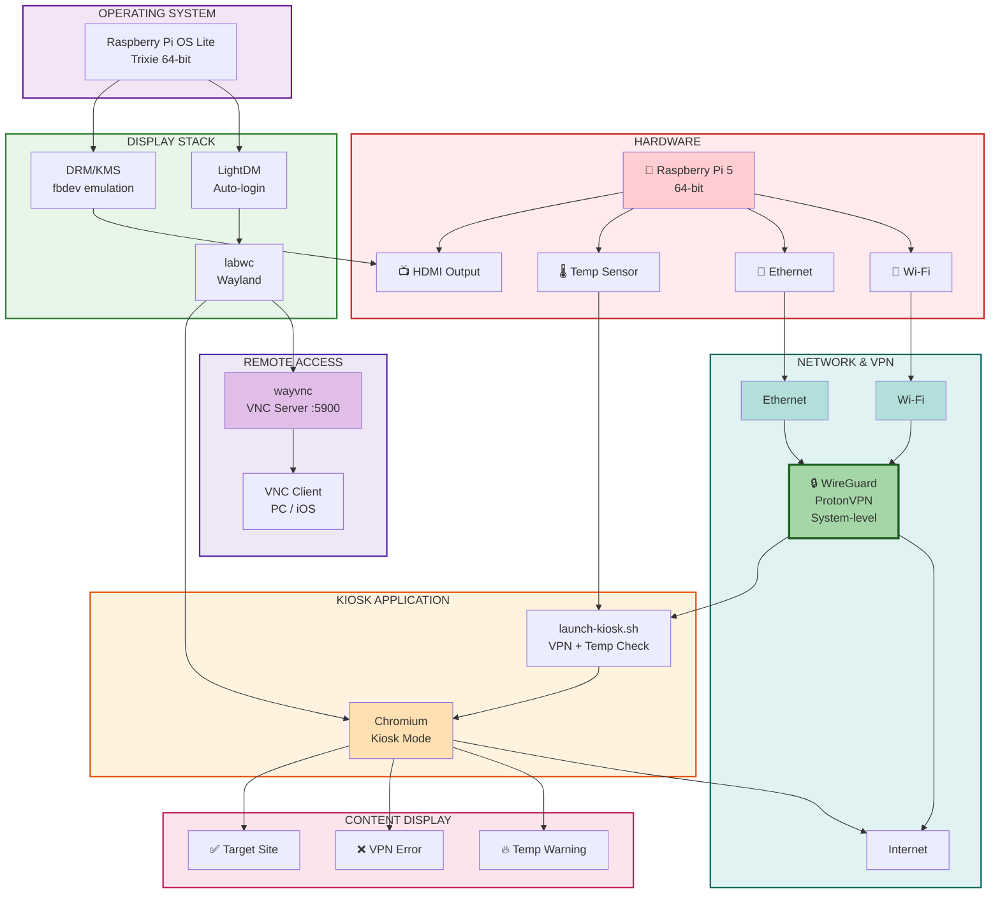

# pikiosk

Raspberry Pi 5 kiosk setup with VPN and remote VNC control.

## What it does

- Displays a target website in full-screen kiosk mode on HDMI
- Routes all traffic through **ProtonVPN WireGuard**
- Shows an error page if the VPN is down or temperature exceeds 80°C
- Recovers automatically when conditions are restored
- Remote control via **VNC** (TigerVNC on PC, VNC Viewer on iOS)
- SSH always available for management

## Stack

| Component | Role |
|---|---|
| Raspberry Pi OS Lite 64-bit (Trixie) | OS |
| LightDM | Display manager / autologin |
| labwc | Wayland compositor |
| wayvnc | VNC server (Wayland native) |
| Chromium | Kiosk browser |
| WireGuard / ProtonVPN | VPN |

## Architecture



## Folder structure

```
pikiosk/
├── README.md
├── .gitignore
├── install.sh              # Automated setup script
├── kiosk/
│   ├── launch-kiosk.sh     # VPN + temp check, launches Chromium
│   ├── vpn-error.html      # Shown when VPN is down
│   └── temp-warning.html   # Shown when temperature >= 80°C
├── config/
│   ├── labwc-autostart     # ~/.config/labwc/autostart
│   ├── lightdm-autologin.conf  # /etc/lightdm/lightdm.conf.d/
│   ├── drm.conf            # /etc/modprobe.d/drm.conf
│   └── wireguard-template.conf  # Template for /etc/wireguard/protonvpn.conf
└── scripts/
    └── monitor.sh          # Live power and temperature monitor
```

## Quick setup

1. Flash **Raspberry Pi OS Lite 64-bit** to microSD via Raspberry Pi Imager (enable SSH, set Wi-Fi).
2. SSH into the Pi and clone this repo:
   ```bash
   sudo apt install -y git
   git clone https://github.com/YOUR_USERNAME/pikiosk.git
   cd pikiosk
   ```
3. Copy your ProtonVPN WireGuard config:
   ```bash
   cp /path/to/protonvpn-uk.conf config/wireguard.conf
   ```
4. Run the installer:
   ```bash
   chmod +x install.sh
   ./install.sh
   ```
5. Reboot:
   ```bash
   sudo reboot
   ```

## Changing the target site

Edit `kiosk/launch-kiosk.sh` and update the `URL_SITE` variable at the top.

## VNC access

Connect with **TigerVNC** (PC) or **VNC Viewer** (iOS) to:
```
PI_IP:5900
```
Find the IP with `hostname -I`.

## Useful commands

```bash
# Check VPN status
sudo wg show

# Check external IP (should match VPN server)
curl ifconfig.me

# Monitor power and temperature
./scripts/monitor.sh 60

# Check temperature only
vcgencmd measure_temp

# View kiosk log
tail -f /tmp/kiosk.log

# View VNC log
tail -f /tmp/wayvnc.log

# Restart everything without reboot
pkill chromium; pkill wayvnc; pkill labwc

# Safe shutdown
sudo poweroff
```

## Temperature thresholds

| Range | Status |
|---|---|
| < 60°C | Idle / light load |
| 60–70°C | Normal under load |
| 70–80°C | Heavy load, monitor |
| ≥ 80°C | Warning page shown, content paused |

## Ethernet setup (recommended)

Using Ethernet instead of WiFi gives a more stable and secure connection.

**Find the Ethernet MAC address:**
```bash
ip link show eth0 | grep ether
```

**Assign a fixed IP in your router** (e.g. Fritz!Box):
1. Open `http://fritz.box`
2. Go to **Home Network → Network**
3. Find `pikiosk` by MAC address
4. Enable **"Always assign this network device the same IPv4 address"**
5. Save

**Disable WiFi permanently** (persists across reboots):
```bash
sudo nmcli radio wifi off
```

**Re-enable WiFi if needed:**
```bash
sudo nmcli radio wifi on
```

**Check radio status:**
```bash
nmcli radio
```

## Notes

- The WireGuard config file (`config/wireguard.conf`) is excluded from git via `.gitignore` — never commit VPN credentials.
- If the VPN IP gets blocked, download a different server config from ProtonVPN and replace `/etc/wireguard/protonvpn.conf`.
- WiFi credentials with special characters (e.g. `!`) must be passed with single quotes in `nmcli`.
